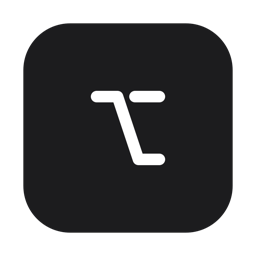

<p align="center">
  
</p>

# JevFlow

Hold Right Option and speak. When you let go, your words land in the field you have focused.

## How it works

Your speech stays on this Mac. [whisper.cpp](https://github.com/ggml-org/whisper.cpp) transcribes it locally. You don't need an account, nothing is billed, and no cloud speech API is involved.

When you release the key, [Jev](https://typesafe.ai) decides how the text should look. It can come out as prose, a list, or a numbered list. Jev also picks which dictionary word you meant. Every word you said stays in the text. If the Jev call fails, JevFlow inserts the local transcript instead.

## TypeSafe key

You don't need a TypeSafe key to use JevFlow. If you have one, save it in Settings or set `TYPESAFE_API_KEY`. The key is never stored in this repo.

## Build

You need macOS 15 and the Swift Command Line Tools. You don't need Xcode.app.

```sh
brew install whisper-cpp
scripts/link-testing-module.sh && swift test
scripts/package-app.sh
```

`scripts/package-app.sh` installs `~/Applications/JevFlow.app`. The speech model and your past takes live in `~/Library/Application Support/Kept`. JevFlow needs Microphone and Accessibility permissions before it can insert text.

The menu-bar icon is the Option key.

## License

JevFlow is released under the [MIT](LICENSE) license. The Option, book, clock, and settings marks come from [Lucide](https://lucide.dev) and are under the ISC license. See [NOTICE](NOTICE).
